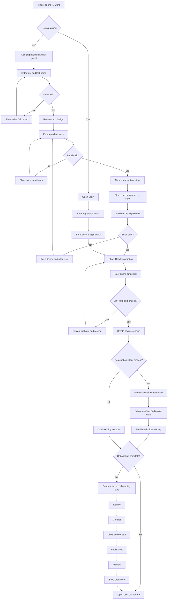

# Production Registration and Onboarding Design

**Date:** 2026-09-05  
**Status:** Approved architecture; specification awaiting review

## Goal

Replace IQ Card's current loose email handoff with a reliable, design-first registration system. A visitor designs a physical card before creating an account, verifies ownership of their email, resumes a server-persisted onboarding wizard, and reaches a private dashboard without losing their card configuration.

The experience must work when the email is opened in the same browser, another browser, or another device. Required-field errors must appear beside the relevant fields at the step where they are needed.

Card scrolling and inspection behavior are explicitly outside this project.

## Product principles

- Let visitors experience the card before asking them to register.
- Use one passwordless email entry point for registration and returning-user login.
- Never lose a completed card design because email delivery or verification failed.
- Persist onboarding progress on the server after every step.
- Require only information needed to establish identity and publish a profile.
- Keep unpublished profiles private by default.
- Explain errors in plain language and always provide a recovery action.

## Primary user flow

## Application architecture

The application remains a Next.js 16 App Router application hosted on Vercel, using Supabase Auth, PostgreSQL, and Storage.

### Browser layer

- Guest customizer remains accessible without authentication.
- Login and registration use the same email-first authentication surface.
- The onboarding wizard is implemented as dedicated application routes, not as a single large client-only form.
- Client validation provides immediate guidance, while server validation remains authoritative.
- Local storage may preserve an unsent guest design as a convenience, but it is not the source of truth after a registration intent is created.

### Next.js server layer

- Route Handlers receive registration-intent and authentication callbacks.
- Server Actions save individual onboarding steps.
- The Next.js proxy refreshes Supabase sessions and protects dashboard, onboarding, and admin routes.
- Redirect decisions are derived from account role and onboarding status on the server.
- Authentication and database errors are mapped to stable, user-facing reason codes.

### Supabase layer

- Supabase Auth owns verified email identity and session issuance.
- PostgreSQL stores accounts, registration intents, profiles, onboarding progress, and profile links.
- Storage holds profile images under owner-scoped paths.
- Row Level Security protects owner data and exposes only published profiles publicly.
- A database function claims a registration intent atomically.

### Email layer

- Production email is delivered through a custom SMTP provider.
- The sending domain must have SPF, DKIM, and DMARC configured.
- The direct token-hash template is the primary confirmation mechanism because it works across browsers and devices.
- One-time code exchange remains a compatibility fallback for the default Supabase template.

## Routes

| Route | Access | Responsibility |
| --- | --- | --- |
| `/customize` | Public | Guest physical-card design |
| `/login` | Public | Email entry for returning users and direct registration |
| `/register/check-email` | Public | Email-sent state, resend countdown, and recovery |
| `/auth/confirm` | Public | Token-hash verification and code-exchange compatibility |
| `/auth/auth-code-error` | Public | Invalid, expired, used, or browser-mismatch recovery |
| `/onboarding/identity` | Authenticated | Required identity and optional photo/title/bio |
| `/onboarding/contact` | Authenticated | Contact details and visibility settings |
| `/onboarding/content` | Authenticated | Links and calls to action |
| `/onboarding/address` | Authenticated | Public-slug selection and reservation |
| `/onboarding/preview` | Authenticated | Exact private preview before publication |
| `/onboarding/publish` | Authenticated | Save privately or publish |
| `/dashboard` | Authenticated | Completed owner dashboard |
| `/admin` | Admin | Administrative account and profile management |

An authenticated user visiting `/login` or `/auth/confirm` is redirected according to role and onboarding state. An incomplete client account is sent to its saved onboarding step; a completed client is sent to `/dashboard`; an administrator is sent to `/admin`.

## Authentication model

The initial production system uses passwordless email authentication only.

1. The user submits a normalized email address.
2. The server applies route or action requests a Supabase magic link with an allow-listed IQ Card callback URL.
3. The email contains a direct token-hash link to `/auth/confirm`.
4. `/auth/confirm` verifies the one-time token, creates the server session, and loads or creates the IQ account.
5. If Supabase returns a one-time code instead, the same route exchanges it for a session.
6. The callback resolves the next destination from server state rather than trusting an arbitrary URL from the query string.

Authentication responses must not reveal whether an email address already has an account. The application applies resend cooldowns and provider rate limits. CAPTCHA may be introduced only after abuse thresholds are reached; it is not part of the default happy path.

Social login and passkeys are future extensions and must not block this project.

## Registration intent

The existing checkout handoff evolves into a formal `registration_intents` model.

### Fields

| Field | Purpose |
| --- | --- |
| `id` | Internal UUID primary key |
| `token_hash` | Hash of the one-time token carried by the email flow |
| `email` | Normalized registration email |
| `design_id` | Stable guest card-design identifier |
| `design_payload` | Validated, versioned card configuration |
| `first_name` | Validated first name |
| `last_name` | Validated last name |
| `status` | `pending`, `claimed`, `expired`, or `cancelled` |
| `owner_id` | Authenticated owner after claim |
| `created_at` | Creation timestamp |
| `expires_at` | Claim deadline, initially 30 minutes |
| `claimed_at` | Successful claim timestamp |

Only a hash of the handoff token is stored. The raw token exists only in the URL and request context.

### Atomic claim contract

The server calls a PostgreSQL function such as `claim_registration_intent(token_hash, owner_id, normalized_email)`. The function succeeds only when:

- the token exists;
- the intent is still pending;
- it has not expired;
- it has not already been claimed; and
- the verified authenticated email matches the registration email.

The transaction claims the intent and associates it with the owner exactly once. Replaying the same link must not create another profile or overwrite an existing owner's data.

## Onboarding state

Onboarding progress is stored in a dedicated `onboarding_progress` record keyed by owner ID.

| Field | Purpose |
| --- | --- |
| `owner_id` | Account being onboarded |
| `schema_version` | Wizard-version compatibility |
| `current_step` | Next incomplete step |
| `completed_steps` | Ordered list of completed step keys |
| `completed_at` | Final completion timestamp |
| `updated_at` | Resume and support diagnostics |

Profile content remains in normalized profile and link tables. `onboarding_progress` stores workflow state, not a duplicate copy of profile data.

Each successful step save updates both its profile data and the progress record in one server-side operation. Returning on another device therefore resumes at the same step.

## Wizard behavior

### 1. Identity

Required:

- First name
- Last name

Optional:

- Profile photo
- Role or professional title
- Short biography

The first and last name are prefilled from the saved physical-card design. The user may edit them. The interface displays `Required` beside both fields and places validation messages directly below the invalid field.

### 2. Contact

- Verified account email is displayed and cannot silently change.
- Public email, phone, WhatsApp, and location are optional.
- Each contact method has an explicit public/private visibility choice.
- Invalid phone or email formats are explained beside the corresponding field.

### 3. Links and content

- Supports website, portfolio, LinkedIn, booking, payment, and custom links.
- A link row is either completely empty or must have both a label and a supported URL.
- Supported schemes are HTTPS, `mailto`, and `tel` where appropriate.
- Incomplete rows show local errors and do not delete previously saved content.

### 4. Public address

- The desired slug is normalized as the user types.
- Availability is checked server-side with a short debounce.
- Final reservation occurs atomically during save.
- Reserved platform paths cannot be selected.
- If unavailable, the server returns deterministic alternatives.

### 5. Preview

- Renders the actual unpublished profile using the same presentation component as the public route.
- Shows the connected physical-card design.
- Provides direct navigation back to the relevant editing step.

### 6. Publish

- Presents two actions: **Save as private draft** and **Publish profile**.
- Publication requires verified email, first name, last name, and a reserved public slug.
- Optional fields never block publication.
- Successful publication records `published_at` and completes onboarding.

## Validation strategy

Validation is shared by browser and server wherever practical, but server validation is authoritative.

- Validate when a field loses focus and when the user attempts to continue.
- Do not display an error before the user has interacted with a field.
- Focus the first invalid field after a failed step submission.
- Preserve all valid values when another field fails.
- Use `aria-invalid`, `aria-describedby`, and `role="alert"` for accessible errors.
- Avoid generic messages such as “Something went wrong” when a specific recovery is possible.
- Show server errors inside the relevant step instead of sending users to a generic application error page.

Mandatory publication rules:

- verified account email;
- first name;
- last name; and
- unique, non-reserved public slug.

## Error and recovery states

| Failure | User experience | System behavior |
| --- | --- | --- |
| Email request fails | Keep email and card; show retry | Retain pending intent or safely retry idempotently |
| Email not received | Resend button with countdown | Reuse or rotate intent token without duplicating the design |
| Link expired | Explain expiration; send new link | Mark old intent expired and preserve the design |
| Link already used | Offer normal login | Never duplicate the account or handoff |
| Email mismatch | Explain that the link belongs to another email | Do not claim or expose the saved design |
| Handoff missing | Continue with normal account onboarding | Log a support reference without exposing tokens |
| Slug unavailable | Show alternatives inline | Leave the wizard on Address |
| Network interruption | Keep current inputs and retry | Do not advance progress until the save succeeds |
| Server failure | Show retry and support reference | Emit structured logs with no secrets or personal payloads |

## Security requirements

- Use HTTP-only, `Secure`, `SameSite=Lax` session cookies in production.
- Allow only configured IQ Card origins for authentication redirects.
- Validate all `next` paths as same-origin relative destinations.
- Store only token hashes, never raw handoff tokens.
- Match the verified session email during handoff claim.
- Apply Row Level Security to all owner-managed tables.
- Keep the Supabase service-role key server-only.
- Rate-limit email requests by normalized email and coarse client signal.
- Make registration-intent creation and claim idempotent.
- Redact email addresses, tokens, and card payloads from logs.
- Expire abandoned intents and periodically remove their payloads.
- Validate uploaded image type, byte size, and owner-scoped storage path.

## Observability

Structured events must cover:

- `registration_intent_created`
- `registration_email_requested`
- `registration_email_failed`
- `auth_confirmation_succeeded`
- `auth_confirmation_failed`
- `registration_intent_claimed`
- `registration_intent_claim_failed`
- `onboarding_step_saved`
- `onboarding_completed`
- `profile_published`

Events contain a generated correlation ID, route, reason code, and timing. They must not contain raw tokens, full emails, or profile payloads.

Production monitoring should alert on sudden increases in email failures, confirmation failures, claim failures, and server errors. A conversion funnel should measure intent creation, email confirmation, onboarding completion, and publication.

## Testing strategy

### Unit tests

- Name, email, phone, URL, and slug validation
- Safe return-path handling
- Registration-intent token hashing and expiry
- Authentication error mapping
- Onboarding destination resolution
- Publication readiness rules

### Integration tests

- Registration-intent creation with malformed and valid designs
- Same-browser code confirmation
- Cross-browser token-hash confirmation
- Atomic claim with matching and mismatched emails
- Duplicate and expired claim behavior
- Step saves and resumable progress
- Slug reservation races
- RLS owner isolation

### Browser end-to-end tests

- Guest design → registration → email confirmation → onboarding → private dashboard
- Returning-user login → dashboard
- Stop onboarding and resume on another browser
- Expired-link resend without losing the design
- Required-field and accessibility behavior at every step
- Private draft remains unavailable publicly
- Publish makes the exact preview available at the chosen slug

Production smoke testing uses a dedicated test mailbox and removes or clearly labels test accounts and profiles after verification.

## Migration and rollout

1. Add the new registration-intent and onboarding-progress schema without removing existing checkout handoffs.
2. Implement atomic claim and dual-read compatibility for existing unexpired handoffs.
3. Introduce server-persisted onboarding routes behind a feature flag.
4. Route newly confirmed accounts into the new wizard.
5. Verify the complete flow using a dedicated production test mailbox.
6. Monitor confirmation, claim, and onboarding error rates.
7. Migrate or expire remaining legacy handoffs.
8. Remove the legacy handoff path only after the observation window is clean.

Rollback disables the new routing flag and returns users to the existing dashboard setup. Database additions remain backward-compatible and do not require destructive rollback.

## Acceptance criteria

- A guest can design a card without authentication.
- First and last name errors appear before leaving Identity.
- A valid design is stored server-side before the confirmation email is sent.
- The email link works in the same browser, another browser, and another device.
- The verified email must match the registration intent before the design can be claimed.
- Refreshing or switching devices resumes the correct onboarding step.
- Required errors appear beside their fields and receive accessible announcement.
- Optional fields never block onboarding or publication.
- Replayed, expired, and mismatched links cannot duplicate or steal a design.
- New profiles start private and become public only through an explicit publish action.
- Returning users bypass completed onboarding and reach the dashboard.
- Registration, confirmation, and onboarding failures are observable without logging secrets.
- Existing physical-card scrolling behavior is unchanged.

## Out of scope

- Card scrolling and WebGL interaction changes
- Payment processing and shipping
- Google, Apple, or other social login
- Passkeys and multi-factor authentication
- CRM integrations
- Marketing automation
- Redesign of the public profile presentation
